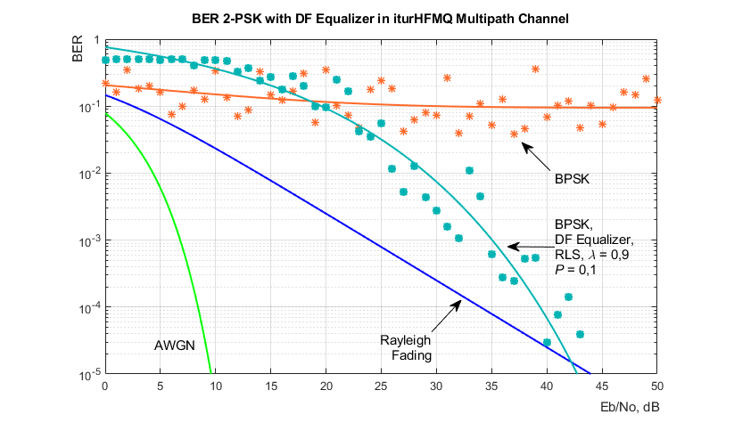
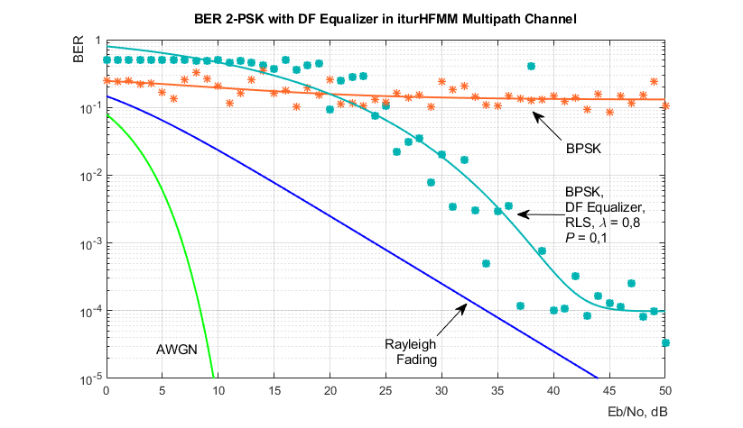
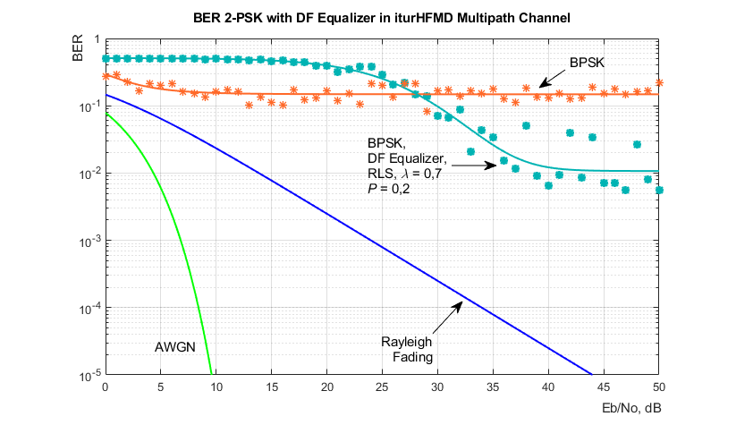

# HF Communication System using M-PSK Modulation and Adaptive Equalizers in ITU-R HF Multipath Fading Channel

### Brief description

This repo is dedicated to MATLAB Imitation Modeling for the BER of the HF Communication System using M-PSK modulation in the HF Communication Channel with multipath and signal fading.

The HF Communication System is constructed using objects and high-developed functions from MATLAB Communication and DSP Toolbox. The HF Channel is constructed based on [HF Ionospheric Channel Models](https://www.mathworks.com/help/comm/examples/hf-ionospheric-channel-models.html) by [`stdchan`](https://www.mathworks.com/help/comm/ref/stdchan.html) function according to [ITU-R Recommendation F.1487 "Testing of HF modems with bandwidths of up to about 12 kHz using ionospheric channel simulator"](https://www.itu.int/rec/R-REC-F.1487/en). For reducing signal fading and BER improving the HF Comm System uses [Adaptive Equalizers](https://www.mathworks.com/help/comm/ug/adaptive-equalizers.html).

The files in the repo can be useful for any communication engineer and MATLAB programmer, who is looking for examples of the BER Imitation Modeling of the Comm Systems.

## Content of the repo

The [HFCommSystem_LSModeling.mlx](HFCommSystem_LSModeling.mlx) contains detailed code and performs Imitation Modeling in the MATLAB Live Script Editor.

The [BERTool_MPSK.m](BERTool_MPSK.m), [BERTool_MPSK_Equalizer_T1.m](BERTool_MPSK_Equalizer_T1.m) and [BERTool_MPSK_Equalizer_T2.m](BERTool_MPSK_Equalizer_T2.m) are functions that used in the [BER Analyzer Tool](https://www.mathworks.com/help/comm/ug/bit-error-rate-ber.html#bsvziy0).

For the BER research and efficiency estimation presented files perform Imitation Modeling for the next cases:
* many types and conditions of the HF Comm Channel with multipath and signal fading, given in [`stdchan`](https://www.mathworks.com/help/comm/ref/stdchan.html) and [ITU-R Recommendation F.1487](https://www.itu.int/rec/R-REC-F.1487/en);
* two types of HF Receiver:
  * without Adaptive Equalizer;
  * with Adaptive Equalizer;
* two types of Adaptive Equalizer [structure](https://www.mathworks.com/help/comm/ug/equalization.html):
  * [Linear Equalizer](https://www.mathworks.com/help/comm/ug/adaptive-equalizers.html#a1049736245);
  * [Decision Feedback Equalizer](https://www.mathworks.com/help/comm/ug/adaptive-equalizers.html#a1049736296b1);
* two types of Equalizers adapting algorithm with training:
  * [LMS](https://www.mathworks.com/help/comm/ug/adaptive-equalizers.html#d120e12871);
  * [RLS](https://www.mathworks.com/help/comm/ug/adaptive-equalizers.html#d120e12917);
* two [training schemes](https://www.mathworks.com/help/comm/ug/adaptive-equalizers.html#mw_043c9308-c7a3-4243-9cdd-0eaa9563d70d) for the Adaptive Equalizer:
  * T1 - training at the begining of each frame;
  * T2 - one-time training at the begining of new BER point.
* As well there are many options to make research, e.g. for modulation order and symbol rate, and many options for signal analysis and visualization.

## BER Results

Here are some BER Results of Imitation Modeling presented in the next Graphs. The HF Comm System uses symbol rate 1000 baud and 2-PSK modulation. The other parameters are shown in the Graphs.

As we see, DF Equalizer demonstrates BER reducing and noise immunity improving. The next research need to be conduct in purpose to find the optimal parameters of DF Equalizer.
